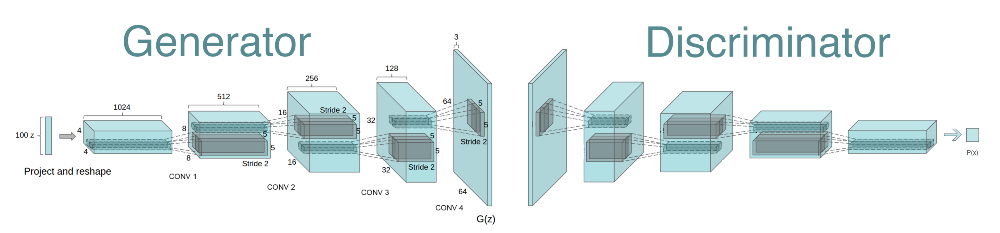

#  Content: Deep Learning
## Project: Deep Rangoli

This project uses a DC-GAN to generate images of rangoli. It was trained on a dataset of 3615 rangoli images.

## Used Libraraies
* TensorFlow 1.4
* Matplotlib
* OpenCV
* PIL
